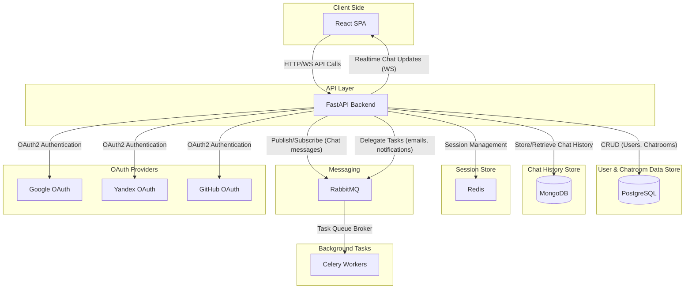
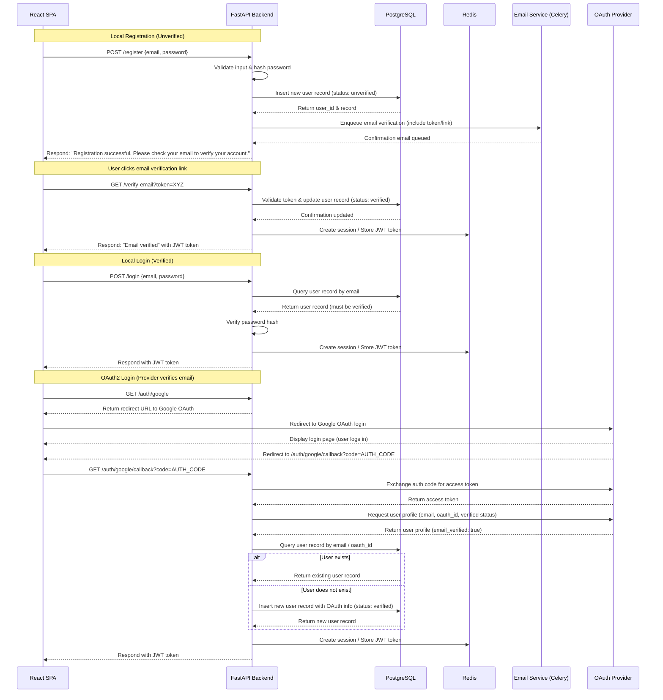

# Description

This is an simlpe realtime messenger with not so simple architecture including message brokers, session storage, distributed task system, ci/cd and so on

> [!WARNING]
> This is TO-BE and not implemented yet

# System Architecture

# Authentication sequence diagram

